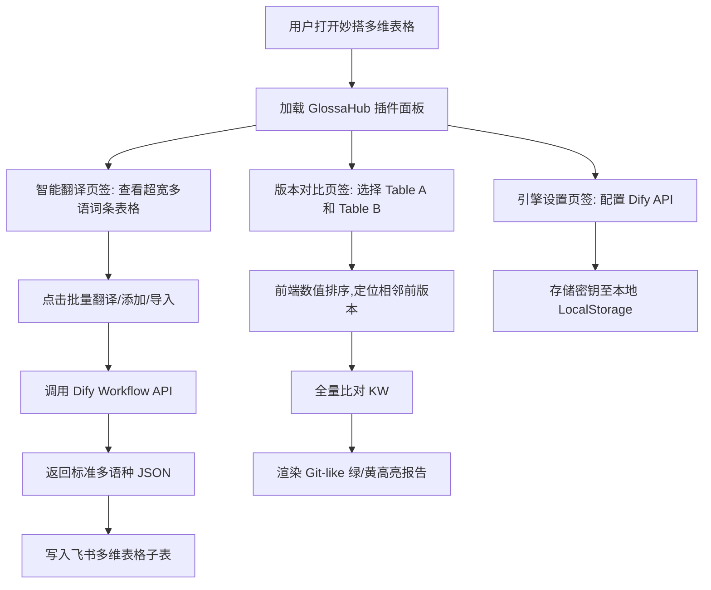

# GlossaHub - 迈金码表词条智能翻译与版本管理平台 产品需求文档 (PRD)

## 1. 项目背景与业务痛点
迈金（Magene）旗下拥有多款面向全球销售的智能 GPS 骑行码表。码表系统内置支持 15+ 种语言包，所有显示的文字词条数量庞大，目前存在以下管理痛点：
1. **人工录入易出错**：历史使用飞书 Excel 表格维护词条，增删改查纯手工修改，容易导致行错位、漏译或格式损坏。
2. **多语种翻译成本高**：新词条录入需多国语言翻译，人工跟进翻译周期长、协作繁琐。
3. **固件版本管理混乱**：词条根据固件版本迭代，旧版是以 Excel Sheet 独立管理，缺乏版本间的清晰差分对比（Diff），难以追溯“谁在什么时间修改了什么词条的哪种语言”。

为了实现企业内部的安全协同且规避复杂的企业管理员审批流程，本项目将采用**飞书“妙搭”（Mioda）**平台进行低代码应用/自定义组件的搭建，以最轻量化的方式对接飞书多维表格（Bitable）。

---

## 2. 产品定位与建设目标
*   **产品定位**：一个嵌入在飞书多维表格（Bitable）中的 **PC 端大屏仪表盘小组件 / 妙搭自定义网页组件**。它是一个纯前端的单页面 Web 应用（SPA），运行在飞书客户端内或网页端浏览器中。
*   **核心开发平台：飞书“妙搭” (Mioda)**。妙搭直接支持在多维表格内部署自定义网页小组件（Extension Widget），**完全继承当前登录用户的多维表格读写权限，无须在飞书开放平台注册全局企业应用，从而完美避开企业 IT 管理员的安全和合规审核流程**。
*   **核心翻译引擎：Dify 工作流 (Workflow)**。摒弃传统的客户端直连大模型 API 的模式，改由前端调用企业或个人搭建好的 **Dify 工作流 API**，通过封装好的翻译工作流输出结构化 JSON，降低开发复杂度，提升翻译效果控制力。
*   **核心建设目标**：
    *   **宽屏大表格视图**：针对 PC 端设计，提供超宽的多语种对照数据网格，方便用户横向滚动浏览全部 15+ 种语言翻译。
    *   **一键批量 AI 翻译**：用户录入中文后，通过 Dify 工作流一键自动生成 15+ 种语言的翻译，支持保存前人工校对。
    *   **固件版本比对（Diff）**：自动读取不同版本子表（如 `3.2`、`3.3`），根据浮点数值进行大小排序，自动识别相邻版本并以 Git 绿色（新增）/ 黄色（修改）高亮方式展示变更细节。
    *   **CSV 导入导出**：支持通过导入 CSV 创建高版本固件子表（自动补齐缺失列），以及将任何版本数据以 UTF-8 BOM 格式导出为 CSV。

---

## 3. 系统核心流程与用户故事 (User Story)

---

## 4. 功能详细设计（面向妙搭/开发引擎）

### 4.1 功能 F-01：PC 大屏词条数据网格 (PC Widescreen Data Grid)
*   **需求说明**：用户在 PC 端的妙搭应用中，能够一目了然地横向浏览所有翻译语言。
*   **设计细节**：
    1.  **超宽列布局**：表格的列名必须与实际 CSV 头部保持一致，依次为：`词条所在界面（注意是界面不是模块！！）`（即上下文描述）、`KW`（即词条唯一 ID）、`负责人`（即 CSV 中无表头的第三列，记录开发人员如王赵云、史东升等）、`中文`（源词），以及 19 种目标语言字段（`英文`、`法语`、`德语`、`西班牙语`、`意大利语`、`葡萄牙语`、`韩语`、`日语`、`俄语`、`波兰语`、`繁体中文`、`丹麦语`、`捷克语`、`瑞典语`、`挪威语`、`荷兰语`、`泰语`、`芬兰语`、`土耳其语`）。
    2.  **固定列 (Freeze Columns)**：为了在横向滚动（Scroll）时保证可读性，最左侧的 `KW` 和 `中文` 两列必须固定在左侧（CSS sticky positioning），不可被横向滑动掩盖。
    3.  **下拉切换版本**：主界面顶部提供版本下拉列表，列出当前 Base 下所有以版本命名的子表（如 `3.2`、`3.3`）。切换后，下方表格数据实时重载。
    4.  **实时检索**：支持对 `KW` 和 `中文` 的快速模糊搜索；提供“仅显示未翻译/缺失译文词条”的快捷过滤开关。

### 4.2 功能 F-02：一键录入与 Dify 智能翻译 (Term Creation & Dify Translate)
*   **需求说明**：在新词条入库或现有词条翻译缺失时，调用 Dify 翻译工作流进行翻译，并支持回写表格。
*   **交互与数据流**：
    1.  **用户操作**：用户点击“新增词条”按钮，弹出浮层表单，输入 `KW`、`中文`、可选的 `词条所在界面（注意是界面不是模块！！）` 和 `负责人`。
    2.  **触发翻译**：用户点击“调用 Dify 翻译”，前端妙搭插件向配置的 Dify 工作流发送 HTTP 请求，Payload 携带 `{ term_id, zh_cn, context, target_languages }`（在请求时前端自动将 `KW` 映射为 `term_id`，`中文` 映射为 `zh_cn`，`词条所在界面（注意是界面不是模块！！）` 映射为 `context`，目标语种的中文名称列表以逗号分隔映射为 `target_languages`，例如 `"英文,法语,德语"`）。
    3.  **大模型翻译响应**：Dify 返回标准的 JSON 格式，其 Key 为对应的目标语言字段名，例如 `{"英文": "Avg Speed", "法语": "Sortie en pause", ...}`。
    4.  **人工审核与回填**：翻译结果在前端弹框的输入框组中渲染，允许人工调整修改。确认无误后，点击“保存”，通过多维表格 SDK (`table.addRecords`) 将该记录批量写入对应的子表中。

### 4.3 功能 F-03：类 Git 的固件版本差分对比 (Version Diff Tool)
*   **需求说明**：用户需要快速查阅两个固件版本（如相邻的 `3.2` 和 `3.3`）之间，有哪些词条被添加了、哪些被修改了。
*   **计算与渲染逻辑**：
    1.  **自动识别前置版本**：
        *   妙搭插件拉取 Base 中所有子表，过滤出以数字/版本命名的子表（过滤掉系统日志表或临时表）。
        *   将版本号按浮点数从小到大排序。
        *   若用户当前选择 $V_{curr} = 3.3$，系统会自动判定其前置相邻版本为 $V_{prev} = 3.2$。
    2.  **数据差分算法**：
        *   同时拉取 $V_{curr}$ 和 $V_{prev}$ 的全量数据（以 `KW` 为唯一键）。
        *   🟩 **新增 (Added)**：存在于 $V_{curr}$ 但不存在于 $V_{prev}$ 的词条，整行呈 **淡绿色背景**，并在操作列显示 `Added` (新增) 标签。
        *   🟨 **修改 (Modified)**：两版本均存在，但任意一个目标语种字段（或中文源词）的内容不一致，整行呈 **淡黄色背景**，操作列显示 `Modified` (修改) 标签。
        *   🟦 **删除 (Deleted)**：存在于 $V_{prev}$ 但不存在于 $V_{curr}$ 的词条。在 Diff 列表中能够以红色删除线形式体现（选做，可作为差分统计信息汇总显示）。
    3.  **修改字段详情**：点击被修改的行，可以展开抽屉查看具体字段의对比（如：`英文: Avg Speed ➔ Average Speed`）。
    4.  **降级方案**：若因表被误删等原因无法在线读取前置版本，支持用户在此界面手动上传“历史版本 CSV 文件”来进行离线差分计算。

### 4.4 功能 F-04：上传 CSV 快速建版 (Create Version via CSV)
*   **需求说明**：通过上传一个包含完整多语种词条的 CSV 包，快速生成一个全新的固件版本子表。
*   **业务校验规则**：
    1.  **版本输入校验**：用户需在上传界面指定新版本号（如 `3.4`）。系统使用正则 `^\d+\.\d+$` 校验格式是否为一位或多位小数。
    2.  **严格递增校验**：系统查询当前 Base 中所有的子表名称，计算出已有最大版本号 $V_{max}$。新版本号 $V_{new}$ 必须满足 $V_{new} > V_{max}$，否则页面拦截并红色警告：“新版本号必须严格大于已有最大版本 $V_{max}$”。
    3.  **动态扩充语种列**：
        *   妙搭插件读取 CSV 文件的表头。
        *   如果 CSV 表头中存在当前多维表格中不存在的列（例如新增了 `荷兰语` 或 `芬兰语` 等），系统**会自动调用多维表格 API 在新创建的子表最右侧追加这些文本字段列**。
    4.  **分批次批量写入**：
        *   通过 `bitable.base.addTable` 创建子表。
        *   将 CSV 数据以 `200条/批` 的大小分批（Chunk）写入新表中，规避接口单次写入超时或超出限制。

### 4.5 功能 F-05：带 BOM 导出的词条 CSV (Export CSV with BOM)
*   **需求说明**：将当前版本的全部词条导出为 CSV 方便工程编译或备份。
*   **规范细节**：
    1.  导出生成的 CSV 文件首部必须包含 **UTF-8 BOM 头** (`\ufeff`)。
    2.  这样可以确保迈金的工程师或翻译人员在 Windows Excel 中直接双击打开此 CSV 时，中文字符能正常显示而不会出现任何“乱码”现象。

### 4.6 功能 F-06：Dify 翻译引擎设置 (Engine Settings)
*   **需求说明**：灵活配置底层的 Dify 工作流，实现参数可配。
*   **设计细节**：
    1.  提供三个核心输入框：
        *   **Dify API Base URL**：Dify 服务地址（例如官方 SaaS 为 `https://api.dify.ai/v1`，或企业自建的内网 Dify 地址）。
        *   **Dify Workflow API Key**：Dify 工作流应用的 API 密钥，输入框需支持“密文隐藏/显现”图标。
        *   **Workflow Name/ID**：(可选) 绑定的工作流标识。
    2.  **存储机制**：以上敏感密钥数据**仅存储在用户当前浏览器的 LocalStorage 中**。绝不上传至任何第三方服务器或明文保存在插件代码中，确保企业密钥的绝对安全。
    3.  **连接测试**：提供“测试连接”按钮。点击后，发送一条测试词条给 Dify，若能正常收到多语种 JSON，则提示“测试成功，翻译引擎已就绪”。

---

## 5. 业务规则与边界约束矩阵

| 规则维度 | 约束定义 | 触发阶段 | 异常处理 |
| :--- | :--- | :--- | :--- |
| **版本号格式** | 必须是小数值（例如 `3.2`） | 导入 CSV 新建版本时 | 正则非匹配则拦截，红字提示：“固件版本号必须为数字格式，如 3.4” |
| **版本号大小** | 新建版本 $V_{new}$ 必须大于当前最大版本 $V_{max}$ | 导入 CSV 新建版本时 | 若 $V_{new} \le V_{max}$，拦截写入并提示：“版本已存在或版本号未递增” |
| **CSV 必填列** | CSV 文件必须包含词条 ID 列和中文源词列 | 上传 CSV 解析时 | 若缺少 `KW`（或 `唯一标识`）及 `中文`，提示：“解析失败，CSV必须包含 KW 和 中文 列” |
| **Excel 兼容性** | 导出的 CSV 文件必须能被 Excel 正常解析且无乱码 | 导出 CSV 时 | 强制在 Blob 字节流最前端插入 `\ufeff` 字符 |
| **Bitable 写入上限** | 单次写入行数不能触发接口熔断 | 导入 CSV / AI 批量回填时 | 前端在写入数组时进行切片，每 200 条记录执行一次 `addRecords` 异步调用 |

---

## 6. 面向妙搭（Mioda）的快速部署与免审指引
为了绕过飞书开放平台“企业管理员审核”的繁琐流程：
1. **开发者权限**：普通员工在自己拥有编辑权限的多维表格中，可以直接开启“妙搭（Mioda）”或“多维表格小组件开发者模式”。
2. **小组件注册**：在表格内直接选择“添加小组件” ➜ “自定义组件”，将打包好的前端 React 静态资源地址（或本地 `http://localhost:5173/` 调试地址）填入，即可直接加载运行。
3. **安全继承**：此模式下，小组件的网页运行在飞书的 iframe 容器内，自动通过 `window.parent` 的 SDK 通道与表格底层通信。**完全不需要为应用配置 Client ID/Client Secret，也完全不需要管理员在企业后台批准应用上线。**
