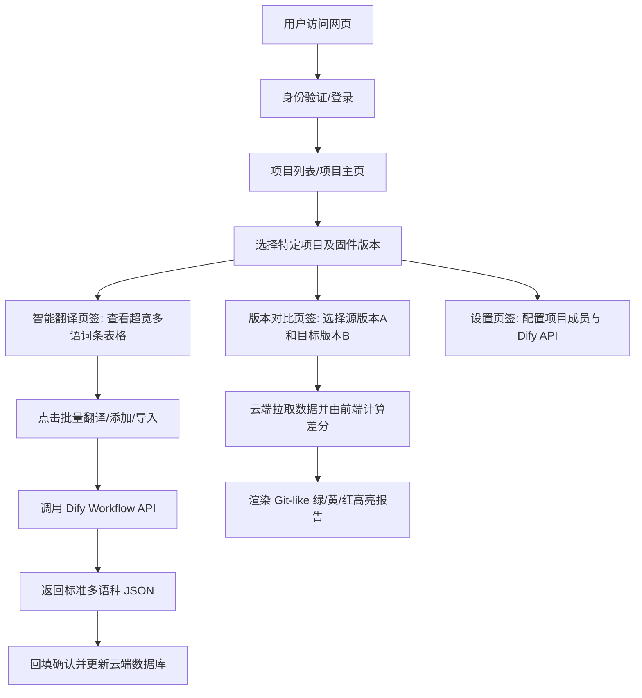

# GlossaHub - 迈金码表词条智能翻译与版本管理平台 产品需求文档 (PRD)

## 1. 项目背景与业务痛点
迈金（Magene）旗下拥有多款面向全球销售的智能 GPS 骑行码表。码表系统内置支持 15+ 种语言包，所有显示的文字词条数量庞大，目前存在以下管理痛点：
1. **人工录入易出错**：历史使用电子表格或传统文档维护词条，增删改查纯手工修改，容易导致行错位、漏译或格式损坏。
2. **多语种翻译成本高**：新词条录入需多国语言翻译，人工跟进翻译周期长、协作繁琐。
3. **固件版本管理混乱**：词条根据固件版本迭代，旧版是以独立表格或 Sheet 隔离，缺乏版本间的清晰差分对比（Diff），难以追溯“谁在什么时间修改了什么词条的哪种语言”。
4. **多人协同效率低**：本地维护导致文件版本冲突，难以做到多人同时在线编辑、审核和实时同步。

为了解决以上痛点，本项目将建设一个**独立的 Web 端多人协同翻译平台 GlossaHub**。系统依托云端数据库，支持多人在线同时维护，并提供自动化的 AI 翻译流水线和严谨的版本差分比对能力。

---

## 2. 产品定位与建设目标
*   **产品定位**：一个独立的 PC 端大屏多人协同翻译与固件版本管理 Web 平台。它是一个基于现代前端框架（React）与云端后端服务（BaaS，如 Supabase）构建的单页面应用（SPA）。
*   **核心协作机制**：**云端多人协同与角色权限管理**。系统通过云端统一数据库存储数据，并支持多租户与项目成员划分，为团队提供多人在线编辑、实时冲突提醒与细粒度的角色控制。
*   **核心翻译引擎：Dify 工作流 (Workflow)**。前端调用企业或个人搭建好的 **Dify 工作流 API**，通过封装好的翻译工作流输出结构化 JSON，降低开发复杂度，提升翻译效果控制力。
*   **核心建设目标**：
    *   **项目与版本多级管理**：支持按设备/固件创建不同的“项目”（Projects），并在项目下管理“固件版本”（Versions）。
    *   **宽屏大表格视图**：针对 PC 端设计，提供超宽的多语种对照数据网格，方便用户横向滚动浏览全部 15+ 种语言翻译，支持固定核心列。
    *   **一键批量 AI 翻译**：用户录入中文后，通过 Dify 工作流一键自动生成 15+ 种语言的翻译，支持保存前人工校对。
    *   **固件版本比对（Diff）**：自动读取不同版本，按版本号大小进行排序，自动识别相邻版本并以 Git 绿色（新增）/ 黄色（修改）高亮方式展示变更细节。
    *   **CSV 导入导出**：支持通过导入 CSV 快速创建新版固件（自动补齐缺失列），以及将任何版本数据以 UTF-8 BOM 格式导出为 CSV。

---

## 3. 系统核心流程与用户故事 (User Story)

---

## 4. 功能详细设计

### 4.1 功能 F-01：多人协作与权限隔离 (User Authentication & RBAC)
*   **需求说明**：为了支持 2 名以上成员协同维护且保证数据安全，系统需提供基于角色的权限控制（RBAC）。
*   **设计细节**：
    1.  **用户登录**：提供独立的邮箱验证码登录/密码登录。
    2.  **角色定义**：
        *   **所有者 (Owner)**：拥有项目的最高权限，可修改项目名称、删除项目、管理项目成员列表及其权限，以及配置项目共享 of Dify 翻译引擎密钥。
        *   **编辑者 (Editor)**：可新增/编辑词条，触发 Dify 智能翻译并回填数据，导入 CSV 新建版本。
        *   **只读协作者 (Viewer)**：仅能查看项目内的词条、进行版本对比和导出 CSV，无法修改任何云端数据。
    3.  **冲突检测机制**：当多名编辑者同时编辑同一条词条时，系统应提示“此词条已被其他用户修改，请刷新重试”，采用乐观锁或最后写入生效的策略保证数据一致性。

### 4.2 功能 F-02：PC 大屏词条数据网格 (PC Widescreen Data Grid)
*   **需求说明**：用户能够在 PC 端的高端显示器上横向浏览所有翻译语言。
*   **设计细节**：
    1.  **超宽列布局**：表格的列名必须与实际 CSV 头部保持一致，依次为：`词条所在界面`（上下文描述）、`KW`（词条唯一 ID）、`负责人`（开发人员，如王赵云、史东升等）、`中文`（源词），以及 19 种目标语言字段（`英文`、`法语`、`德语`、`西班牙语`、`意大利语`、`葡萄牙语`、`韩语`、`日语`、`俄语`、`波兰语`、`繁体中文`、`丹麦语`、`捷克语`、`瑞典语`、`挪威语`、`荷兰语`、`泰语`、`芬兰语`、`土耳其语`）。
    2.  **固定列 (Freeze Columns)**：为了在横向滚动（Scroll）时保证可读性，最左侧的 `KW` 和 `中文` 两列必须固定在左侧（CSS sticky positioning），不可被横向滑动掩盖。
    3.  **下拉切换版本**：主界面顶部提供版本下拉列表，列出当前项目下所有以版本命名的固件表（如 `3.2`、`3.3`）。切换后，下方表格数据实时重载。
    4.  **实时检索与过滤**：支持对 `KW` 和 `中文` 的快速模糊搜索；提供“仅显示未翻译/缺失译文词条”的过滤开关。

### 4.3 功能 F-03：一键录入与 Dify 智能翻译 (Term Creation & Dify Translate)
*   **需求说明**：在新词条入库或现有词条翻译缺失时，调用 Dify 翻译工作流进行翻译，并支持回写云端数据库。
*   **交互与数据流**：
    1.  **用户操作**：用户点击“新增词条”按钮，弹出浮层表单，输入 `KW`、`中文`、可选的 `词条所在界面` 和 `负责人`。
    2.  **触发翻译**：用户点击“调用 Dify 翻译”，前端向 Dify 工作流接口发送 HTTP 请求，Payload 携带 `{ term_id, zh_cn, context, target_languages }`（在请求时前端自动将 `KW` 映射为 `term_id`，`中文` 映射为 `zh_cn`，`词条所在界面` 映射为 `context`，目标语种的中文名称列表以逗号分隔映射为 `target_languages`，例如 `"英文,法语,德语"`）。
    3.  **大模型翻译响应**：Dify 返回标准的 JSON 格式，其 Key 为对应的目标语言字段名，例如 `{"英文": "Avg Speed", "法语": "Sortie en pause", ...}`。
    4.  **人工审核与回填**：翻译结果在前端弹框的输入框组中渲染，允许人工调整修改。确认无误后，点击“保存”，将数据批量写入云端数据库中，并通知其他在线协同用户。

### 4.4 功能 F-04：类 Git 的固件版本差分对比 (Version Diff Tool)
*   **需求说明**：用户需要快速查阅两个固件版本（如相邻的 `3.2` 和 `3.3`）之间，有哪些词条被添加了、哪些被修改了。
*   **计算与渲染逻辑**：
    1.  **自动识别前置版本**：
        *   系统查询当前项目下所有的固件版本，过滤出以数字/版本命名的版本。
        *   将版本号按浮点数从小到大排序。
        *   若用户当前选择 $V_{curr} = 3.3$，系统会自动判定其前置相邻版本为 $V_{prev} = 3.2$。
    2.  **数据差分算法**：
        *   拉取 $V_{curr}$ 和 $V_{prev}$ 的数据（以 `KW` 为唯一键）。
        *   🟩 **新增 (Added)**：存在于 $V_{curr}$ 但不存在于 $V_{prev}$ 的词条，整行呈 **淡绿色背景**，并在操作列显示 `Added` (新增) 标签。
        *   🟨 **修改 (Modified)**：两版本均存在，但任意一个目标语种字段（或中文源词）的内容不一致，整行呈 **淡黄色背景**，操作列显示 `Modified` (修改) 标签。
        *   🟦 **删除 (Deleted)**：存在于 $V_{prev}$ 但不存在于 $V_{curr}$ 的词条。在 Diff 列表中可以独立选项卡或在对比区域以红色删除线形式体现，方便追溯被移除的词条。
    3.  **修改字段详情**：点击被修改的行，可以展开抽屉查看具体字段的对比（如：`英文: Avg Speed ➔ Average Speed`）。
    4.  **降级方案**：若因版本被删除等原因无法在线读取前置版本，支持用户在此界面手动上传“历史版本 CSV 文件”来进行本地内存差分计算。

### 4.5 功能 F-05：上传 CSV 快速建版 (Create Version via CSV)
*   **需求说明**：通过上传一个包含完整多语种词条的 CSV 包，在当前项目中快速生成一个全新的固件版本。
*   **业务校验规则**：
    1.  **版本输入校验**：用户需在上传界面指定新版本号（如 `3.4`）。系统使用正则 `^\d+\.\d+$` 校验格式是否为一位或多位小数。
    2.  **唯一性校验**：系统查询当前项目下的所有版本。新版本号不能与已有版本重复，否则拦截并警告：“该版本号已存在”。
    3.  **动态扩充语种**：
        *   系统读取 CSV 文件的表头。
        *   如果 CSV 表头中存在当前系统中尚未定义的列（例如新增了 `荷兰语` 或 `芬兰语` 等），系统应自动允许将其作为新的 key-value 拼入词条的 translations 对象中进行存储，前端网格视图将根据最新汇总的所有语种 key 动态生成新语种列。
    4.  **云端高效批量写入**：
        *   将 CSV 数据以 `200条/批` 的大小分批（Chunk）异步 upsert 写入云端数据库，提供进度条，规避网络抖动和单次请求超时。

### 4.6 功能 F-06：带 BOM 导出的词条 CSV (Export CSV with BOM)
*   **需求说明**：将当前版本的全部词条导出为 CSV 方便工程编译或备份。
*   **规范细节**：
    1.  导出生成的 CSV 文件首部必须包含 **UTF-8 BOM 头** (`\ufeff`)。
    2.  确保迈金的工程师或翻译人员在 Windows Excel 中直接双击打开此 CSV 时，中文字符能正常显示而不会出现任何“乱码”现象。

### 4.7 功能 F-07：Dify 翻译引擎设置 (Engine Settings)
*   **需求说明**：灵活配置底层的 Dify 工作流，实现参数可配。
*   **设计细节**：
    1.  提供三个核心输入框：
        *   **Dify API Base URL**：Dify 服务地址（例如官方 SaaS 为 `https://api.dify.ai/v1`，或企业自建的内网 Dify 地址）。
        *   **Dify Workflow API Key**：Dify 工作流应用的 API 密钥，输入框需支持“密文隐藏/显现”图标。
        *   **Workflow Name/ID**：(可选) 绑定的工作流标识。
    2.  **存储级别选择**：
        *   **本地存储（LocalStorage）**：将 API 密钥仅保存在用户浏览器的 LocalStorage 中，绝对安全，其他协同人员不可见。
        *   **云端加密存储（Cloud Project Config）**：仅限 Project Owner 可配置，将其加密存储在云端 `projects` 配置中。项目内的所有 Editor 可共享此翻译通道，免去重复配置的繁琐。

---

## 5. 业务规则与边界约束矩阵

| 规则维度 | 约束定义 | 触发阶段 | 异常处理 |
| :--- | :--- | :--- | :--- |
| **版本号格式** | 必须是小数值（例如 `3.2`） | 导入 CSV 新建版本时 | 正则非匹配则拦截，红字提示：“固件版本号必须为数字格式，如 3.4” |
| **版本号唯一性**| 新建版本号在当前项目中不可重复 | 导入 CSV 新建版本时 | 若版本号已存在，拦截写入并提示：“该固件版本已存在” |
| **CSV 必填列** | CSV 文件必须包含词条 ID 列和中文源词列 | 上传 CSV 解析时 | 若缺少 `KW`（或 `唯一标识`）及 `中文`，提示：“解析失败，CSV 必须包含 KW 和 中文 列” |
| **Excel 兼容性** | 导出的 CSV 文件必须能被 Excel 正常解析且无乱码 | 导出 CSV 时 | 强制在 Blob 字节流最前端插入 `\ufeff` 字符 |
| **云端批量写入上限** | 单次写入行数不能触发数据库连接超时 | 导入 CSV / AI 批量回填时 | 前端在写入数组时进行切片，每 200 条记录执行一次接口异步调用 |
| **角色权限拦截** | 非授权角色无法执行修改操作 | 新增/编辑词条、导入建版 | 前端隐藏操作按钮，后端基于行级安全策略（RLS）进行接口鉴权拦截 |

---

## 6. 云端多人协同与安全机制

独立的云端部署模式下，GlossaHub 通过以下机制保护数据并提升团队协作效率：
1. **身份认证 (Auth)**：基于行业标准 JWT 的登录机制，限制只有被邀请的企业内部协作者才能通过身份验证进入系统。
2. **行级安全策略 (Row-Level Security, RLS)**：通过数据库底层策略，确保只有项目成员（在 `project_members` 关联中存在记录的用户）才能读取和写入该项目下的版本和词条，彻底防止横向越权。
3. **前端状态实时同步**：当某用户成功添加/修改了词条或创建了新版本，云端数据库可提供实时更新通知（Websockets），在其他在线协同者的屏幕上高亮提示，避免重复修改。
