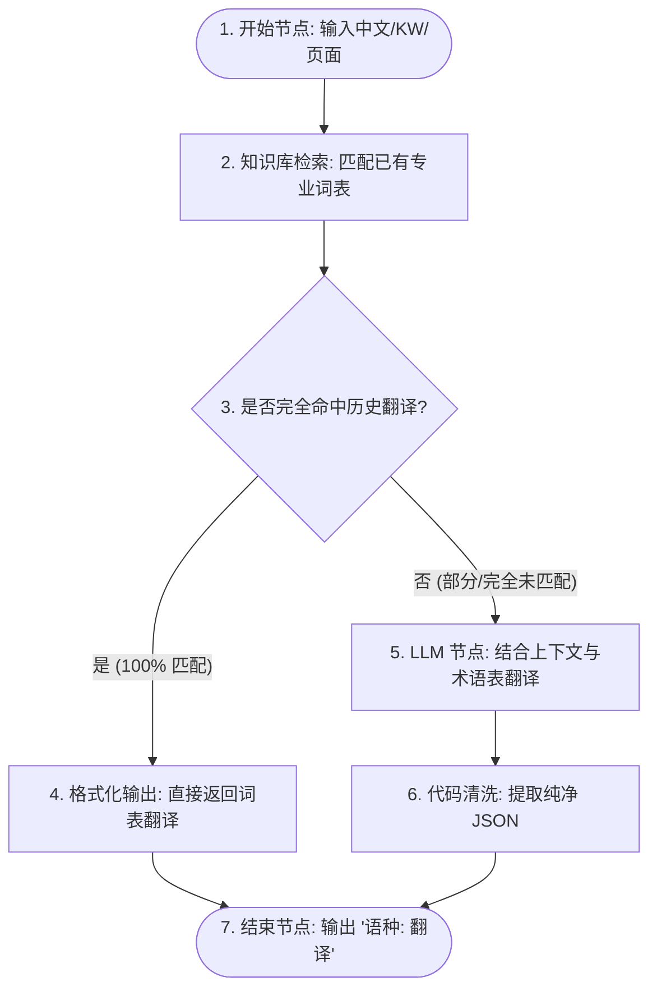

# GlossaHub - Dify 智能翻译工作流配置指南（产品经理版）

本指南专为 **产品经理 (PM)** 设计，指导如何从零开始在 **Dify** 中配置一套包含“**专业词汇知识库 + LLM 兜底翻译**”的智能翻译工作流。配置完成后，飞书多维表格（GlossaHub）即可一键调用该接口，获取格式统一、术语精准的骑行码表翻译。

---

## 1. 整体工作流设计

为了确保骑行专业词汇（如踏频、功率、坡度等）的绝对准确，同时兼顾其他词汇的智能翻译，工作流采用以下设计：



*   **输入**：中文原词、KW 标识、所在页面上下文、需要翻译的目标语种。
*   **输出**：格式为 `{"语种": "翻译结果"}` 的 JSON 对象。

---

## 2. 步骤一：创建并配置“专业词汇知识库”

在配置工作流之前，需要将 Magene 已有的专业词表导入 Dify。

1.  登录 Dify 控制台，点击顶部菜单的 **“知识库 (Knowledge)”**。
2.  点击 **“创建知识库”**。
3.  **上传术语表**：准备一个 CSV 或 Excel 格式的专业词汇表，格式示例如下：
    | 中文 | 英文 (English) | 西班牙语 (Español) | 描述/备注 |
    | :--- | :--- | :--- | :--- |
    | 踏频 | Cadence | Cadencia | 自行车每分钟踏板旋转圈数 |
    | 坡度 | Slope | Pendiente | 骑行道路的倾斜度，切勿用 Gradient |
    | 平均速度 | Avg Speed | Vel. Media | 屏幕限制，需用简写 |
4.  选择 **“高质量 (High Quality)”** 索引模式，等待系统分段并向量化完成。
5.  将该知识库命名为：`Magene 骑行码表专业词汇库`。

---

## 3. 步骤二：创建工作流应用

1.  在 Dify 主页点击 **“创建空白应用”**。
2.  选择 **“工作流 (Workflow)”**。
3.  命名为：`GlossaHub 词条智能翻译工作流`，点击 **“创建”**。

---

## 4. 步骤三：配置“开始”节点（Start Node）

开始节点用于接收飞书多维表格发送的数据。请在开始节点中添加以下 **4 个输入变量**：

| 变量标识 (Key) | 变量类型 (Type) | 是否必填 | 描述与示例 |
| :--- | :--- | :--- | :--- |
| `KW` | 单行文本 (Short Text) | 是 | 词条唯一标识（如 `KW_RIDE_PAUSED`） |
| `text` | 段落文本 (Paragraph) | 是 | 需要翻译的中文源词（如 `骑行已暂停`） |
| `所在页面` | 段落文本 (Paragraph) | 是 | 词条所在的页面/限制描述（如 `表盘页面，最大8个字符`） |
| `语种` | 段落文本 (Paragraph) | 是 | 逗号分隔的语种列表（如 `英文,法语,德语,西班牙语`） |

---

## 5. 步骤四：插入“知识库检索”节点

为了在翻译前先查阅已有词表：

1.  在“开始”节点右侧点击 **`+`** 按钮，添加 **“知识库检索 (Knowledge Retrieval)”** 节点。
2.  在节点中关联您在步骤一创建的 `Magene 骑行码表专业词汇库`。
3.  将 **“查询变量 (Query Variable)”** 设置为 `开始.text`（即开始节点输入的 `text`）。
4.  **检索设置**：推荐使用混合检索（Vector + Full-text），以确保高度匹配。

---

## 6. 步骤五：配置“LLM”翻译节点

当知识库中没有现成的匹配，或者需要大模型配合语境进行翻译时，使用此节点。

1.  在工作流中添加 **“LLM”** 节点。
2.  **选择模型**：推荐选择推理能力强的模型，例如 `deepseek-chat` 或 `gpt-4o`。
3.  **温度设置 (Temperature)**：设为 `0.1` ~ `0.2`（确保翻译稳定，不随意发挥）。
4.  **Prompt（提示词）配置**：
    在 LLM 节点的提示词框中粘贴以下内容（可根据实际需要微调）：

```text
你是一个精通自行车运动、GPS骑行码表及相关配件的专业软件国际化翻译专家。
现在，请你翻译下方输入的中文词条。

### 核心翻译原则：
1. 【行业专有名词约束】：必须严格符合自行车运动的行业规范与下方提供的参考词汇。
   * 踏频 -> Cadence
   * 坡度 -> Slope 或 Grade (切勿翻译为 chemistry 领域的 Gradient)
   * 功率 -> Power
   * 心率 -> Heart Rate (或缩写 HR)
2. 【大屏UI空间约束】：自行车码表屏幕尺寸很小（通常2.4-3.0英寸），界面文本必须极度精炼。
   * 尽量使用骑行领域的标准缩写（例如：Average 缩写为 Avg，Maximum 缩写为 Max，Minimum 缩写为 Min）。
   * 仔细参考输入的 context 提示（如果指明了字符限制，翻译长度绝对不能超过该限制）。
3. 【专业词库参考 (若有检索到匹配内容)】：
   如果在下方【参考词条】中有相关的专业翻译，请优先采用或参考其翻译风格。

### 输入上下文：
- 词条 ID (Key): {{#开始.KW#}}
- 中文源词 (Source): {{#开始.text#}}
- 页面上下文/字符限制 (Context): {{#开始.所在页面#}}
- 目标语种列表 (Target Languages): {{#开始.语种#}}

### 检索到的参考词条（来自知识库）：
{{#知识检索.result#}}

### 输出格式要求：
你必须直接输出纯 JSON 字符串，不能包含任何 markdown 的包裹标记（切勿使用 ```json 开头 and ``` 结尾），以保证我的程序能直接解析。

要求的 JSON 输出格式：
键为目标语种中文名称，值为对应的翻译结果。示例如下：
{
  "英文": "Ride Paused",
  "法语": "Sortie en pause",
  "德语": "Fahrt pausiert"
}
```
> [!IMPORTANT]
> 请注意，在 Dify 流程编辑器中，当你在 Prompt 框中输入 `{{` 或输入 `/` 时，会自动弹出变量选择菜单。请务必关联选择对应的变量，以保证 `{{#开始.KW#}}`、`{{#开始.text#}}`、`{{#开始.所在页面#}}`、`{{#开始.语种#}}` 和 `{{#知识检索.result#}}` 路径正确。


---

## 7. 步骤六：配置“代码”节点（格式清洗与转换）

为确保输出的格式百分之百是合法的 `{"语种": "翻译"}` JSON 字典，避免大模型输出 Markdown 标记，我们需要加一个代码清洗节点。

1.  添加 **“代码 (Code)”** 节点，选择 **`Python3`** 语言。
2.  **设置输入变量**：
    *   参数名：`llm_output`
    *   绑定值：选择上一步 **LLM 节点** 的 `text` 输出。
3.  **编写清洗代码**（直接使用 Dify 代码节点默认的 `result` 输出结构，无需在右侧手动更改输出变量名称）：

```python
import json
import re

def main(llm_output: str) -> dict:
    # 1. 剔除大模型可能输出的 Markdown codeblock 标记
    cleaned = re.sub(r'^```json\s*', '', llm_output, flags=re.IGNORECASE)
    cleaned = re.sub(r'\s*```$', '', cleaned)
    cleaned = cleaned.strip()
    
    # 2. 尝试解析，确保其是合法 JSON
    try:
        parsed = json.loads(cleaned)
        # 将解析后的干净 JSON 重新序列化为字符串输出
        return {
            "result": json.dumps(parsed, ensure_ascii=False)
        }
    except Exception as e:
        # 如果解析失败，回退为一个包含 error 字段的原样 JSON
        error_res = {
            "error": f"JSON解析失败: {str(e)}",
            "raw_output": llm_output
        }
        return {
            "result": json.dumps(error_res, ensure_ascii=False)
        }
```

---

## 8. 步骤七：配置“结束”节点（End Node）

1.  添加 **“结束”** 节点。
2.  添加一个输出变量，命名为 `translations`。
3.  变量值（Value）绑定为上一个 **代码节点** 的 **`result`** 输出值。


---

## 9. 调试与发布

1.  **测试运行**：点击右上角 **“运行”** 按钮。
2.  在弹窗中输入测试数据：
    *   `term_id`: `KW_AVG_CADENCE`
    *   `zh_cn`: `平均踏频`
    *   `context`: `数据页面，限8字符`
    *   `target_languages`: `英文,法语,西班牙语`
3.  点击 **“开始运行”**，确认最终的输出格式符合预期：
    ```json
    {
      "translations": "{\"英文\": \"Avg Cad\", \"法语\": \"Cad Moy\", \"西班牙语\": \"Cad Med\"}"
    }
    ```
4.  确认无误后，点击右上角 **“发布”** ➜ **“更新运行”**。
5.  在左侧导航栏的 **“API 访问”** 页面生成密钥，提供给开发人员配置到 GlossaHub 中。
