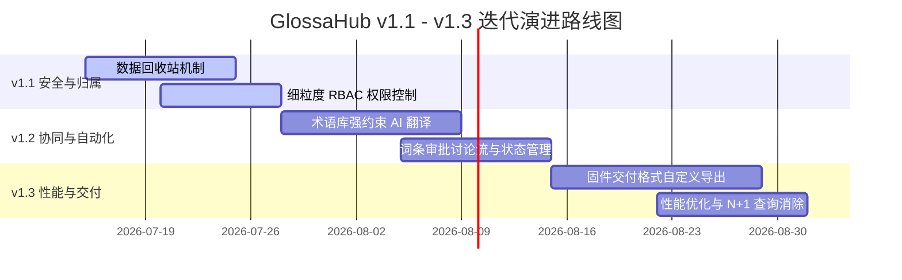

# GlossaHub 迭代规划说明书 (v1.1 - v1.3)

本规划书针对 GlossaHub 协同数据平台后续的三个重要版本（v1.1、v1.2、v1.3）进行功能模块与演进路线设计。当前基准版本视为 **v1.0**，开发分支将以此路线图为指导进行规划与实施。



---

## 📅 迭代规划总览

| 版本 | 核心定位 | 核心功能点 | 业务价值 |
| :--- | :--- | :--- | :--- |
| **v1.1** | **数据安全与权限边界** | 1. 级联数据回收站（Recycle Bin）<br>2. 细粒度 RBAC 权限（Owner/Editor/Viewer） | 保护多人协作时的高危数据，彻底消除误删隐患与越权修改风险。 |
| **v1.2** | **智能协同与翻译流** | 1. 术语匹配约束 AI 翻译（Glossary Hook）<br>2. 词条状态流与讨论板（Review & Discuss） | 提升 Dify 翻译的专业准确度，让译员间的争论与审批过程完全在线化。 |
| **v1.3** | **交付提效与性能优化** | 1. 固件级多格式导出（C语言/Android XML/JSON）<br>2. 数据库 N+1 查询与渲染性能优化 | 打通翻译系统到固件编译的最后一公里，并保障大体量词条下的页面流畅度。 |

---

## 🛠️ 各版本详细设计规范

---

### 1. v1.1 迭代设计：数据安全与权限边界

#### 1.1 级联数据回收站（Recycle Bin）
*   **设计背景**：目前删除数据表（版本）、专业词汇表、语种字典均为硬删除。若发生误删，将导致关联翻译数据级联清空，不可恢复。
*   **方案规格**：
    *   **后端数据存储**：新建 `recycle_bin` 表：
        ```sql
        CREATE TABLE recycle_bin (
            id TEXT PRIMARY KEY,
            entity_type TEXT NOT NULL, -- 'version' | 'glossary_table' | 'language'
            entity_name TEXT NOT NULL,
            payload JSONB NOT NULL,    -- 存储删除对象的完整 JSON 序列化数据（包括所有关联子表记录）
            deleted_by TEXT REFERENCES users(id),
            deleted_at TEXT NOT NULL,
            expires_at TEXT NOT NULL   -- 30天后自动清除
        );
        ```
    *   **级联序列化**：当删除版本表时，系统先查询该版本下所有的 `terms` 条目，组合成一个 JSON 数据包作为 `payload` 写入 `recycle_bin`，然后再安全执行 `DELETE`。
    *   **前端回收站 UI**：系统设置页新增“回收站”子标签，列表展示已删除的条目、删除人、剩余天数，提供“一键恢复（Restore）”和“彻底删除”按钮。

#### 1.2 细粒度 RBAC 权限控制
*   **设计背景**：目前只要加入项目的成员均拥有对版本的“删除、重命名、全量覆盖”等特权，缺少对只读译员和外部审查人员的控制。
*   **角色行为矩阵**：

| 操作权限 | 角色：Owner (项目创建者) | 角色：Editor (普通译员) | 角色：Viewer (只读审核/外部顾问) |
| :--- | :---: | :---: | :---: |
| 浏览看板与导出 | ✅ | ✅ | ✅ |
| 修改词条翻译 / AI 单译 | ✅ | ✅ | ❌ |
| 批量新增 / 批量 AI 翻译 | ✅ | ✅ | ❌ |
| 新建版本 / 专业词汇库 | ✅ | ✅ (不可删除) | ❌ |
| **锁定 / 解锁词条** | ✅ | ❌ | ❌ |
| **删除版本 / 删除词汇表** | ✅ | ❌ | ❌ |
| 项目成员邀请与设置 | ✅ | ❌ | ❌ |

*   **技术实施**：
    *   升级 `authenticateToken` 和 `requireProjectMember` 拦截器，增加角色标识提取。
    *   新建 `requireRole(allowedRoles)` 路由中间件，例如：`app.delete('/api/versions/:id', authenticateToken, requireRole(['owner']), ...)`。
    *   前端配合隐藏或禁用不符权限的按钮（如 Editor 和 Viewer 界面上的“删除数据表”按钮置灰）。

---

### 2. v1.2 迭代设计：智能协同与翻译流

#### 2.1 术语匹配约束 AI 翻译（Glossary-Constrained AI Translation）
*   **设计背景**：AI 翻译时，常常会忽略已经达成的专有名词共识（如已确定“平均踏频”翻译为“Avg Cadence”，但 AI 依然翻译成“Average Pedaling Rate”），导致翻译前后不一致。
*   **实施方案**：
    *   在触发 Dify 翻译前，后端先通过中文分词或正向最大匹配算法，比对当前项目的“专业词汇库（Glossary Table）”。
    *   如果提取出专业词汇，则将它们拼接成结构化的输入，作为 Dify 工作流中的 `glossary` 输入变量（例如：`[平均踏频 -> Avg Cadence]`）。
    *   修改 Dify 工作流提示词，要求大模型在翻译时**必须强行遵循并引用术语库中的译法**，极大提升自动化翻译的专业水平。

#### 2.2 词条审批讨论流与状态管理
*   **设计背景**：很多固件文案需要经过多轮讨论（如字数超限、缩写不妥等）。现有的 `status` (DRAFT / PENDING_REVIEW / APPROVED / REJECTED) 缺少协同讨论能力。
*   **功能规格**：
    *   **详情弹窗增强**：在编辑词条翻译右侧，除了“翻译建议”和“历史记录”外，新增“**词条讨论板 (Comments)**”。
    *   **讨论板数据表**：
        ```sql
        CREATE TABLE term_comments (
            id TEXT PRIMARY KEY,
            term_id TEXT REFERENCES terms(id) ON DELETE CASCADE,
            user_id TEXT REFERENCES users(id) ON DELETE SET NULL,
            content TEXT NOT NULL,
            created_at TEXT NOT NULL
        );
        ```
    *   **审批打回工作流**：当管理员将词条状态设为 `REJECTED` 时，强制要求输入“驳回原因 (reject_reason)”，驳回原因会自动以系统通知形式贴入该词条的“讨论板”中，方便译员查看并针对性修改重新提交审核。

---

### 3. v1.3 迭代设计：交付提效与性能优化

#### 3.1 固件级多格式自定义导出 (Firmware Custom Exporter)
*   **设计背景**：翻译最终要烧录进码表固件，而固件团队需要的格式多为代码或特定的配置文件，现有的 Excel/CSV 格式还需要开发人员二次手动解析转换。
*   **实施方案**：
    *   **格式自定义面板**：在导出页面增加格式选择：
        1.  **C/C++ Header (.h)**：自动导出为 C 语言结构体数组，包含 `const char*` 定义。
        2.  **Android String XML (.xml)**：导出为标准的 Android 多语言 strings.xml。
        3.  **Nested JSON**：支持将点号键（如 `KW.HOME.TITLE`）导出为嵌套的 JSON 树结构，适合前端 App 接入。
    *   **一键打包下载**：支持勾选多个语种，一键生成多语言包 zip 压缩文件，实现与研发流程 of 无缝对接。

#### 3.2 性能加固与 N+1 查询优化
*   **设计背景**：目前在拉取版本列表时，每个版本需要计算其中的词条总数、未翻译数等统计指标，存在严重的 N+1 SQL 查询，导致页面载入较慢。
*   **优化方案**：
    *   **SQL 聚合查询**：使用 SQL 的 `LEFT JOIN` 与 `GROUP BY` 代替循环查询，在拉取版本列表的同时，一次性算好所有的统计计数。
    *   **虚拟列表（Virtual List）**：由于词条数往往超过 1000 条，渲染全部 DOM 节点会导致前端卡顿。在 `TranslationTab.jsx` 中引入虚拟滚动，仅渲染可视区内的 50-100 行表格，大幅提升渲染性能。
