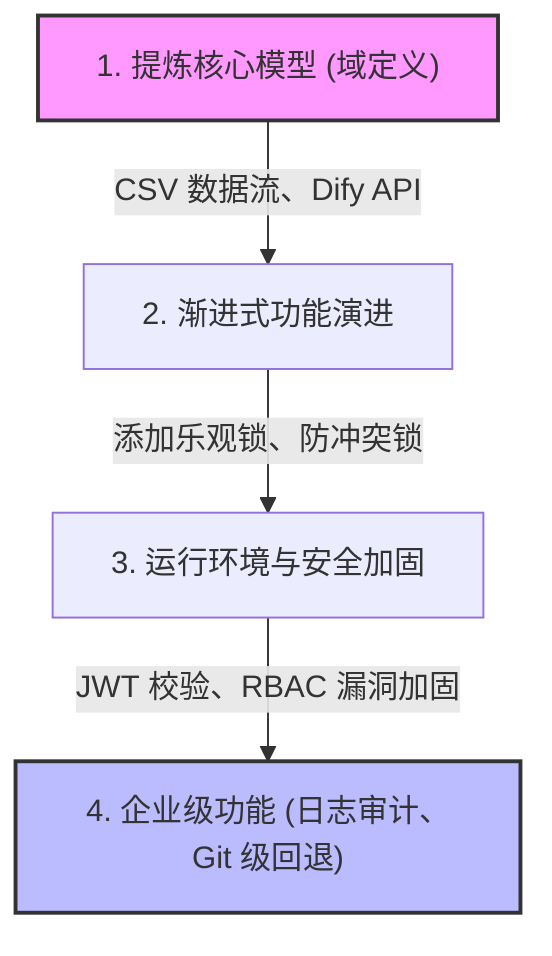

# 💡 GlossaHub 提示词驱动开发指南（开发方法论与实战拆解）

本指南面向团队开发成员，通过对 GlossaHub 从 `v0.1` 迭代至 `v1.1` 的**用户指令历史**进行意图分类与模式提炼，总结出了一套**“声明式意图 -> 渐进式交付”**的提示词驱动开发（Prompt-Driven Development）方法论。你可以使用这篇文档直接向组员讲解如何利用 AI 助手从零构建一个企业级协同翻译系统。

---

## 🎯 核心开发路径与意图拆解

项目整体开发可以归纳为以下四个核心意图阶段，每个阶段代表了系统成熟度的一次飞跃：

### 阶段一：架构重塑与基础建设 (v0.1 -> v0.2)
*   **开发意图**：摆脱飞书多维表格（妙搭/Bitable）的生态限制，将业务完全剥离为独立的、可私有化部署的 Web 应用（React + Node.js + SQLite）。
*   **提示词演进思路**：
    1.  **解耦评估**：“如果不创建飞书应用，如何获取飞书数据的读取、修改、新增权限？” -> *确认脱离飞书的可行性*。
    2.  **一键声明架构**：“我想脱离妙搭，由你来完成所有功能：导入/导出 CSV、增删改查词条、保存修改记录并高亮、支持版本对比。” -> *给出全套技术栈框架*。
    3.  **对齐核心能力**：针对已有的复杂 CSV 文件进行“目标语种识别”与“RFC-4180 规范解析”。

---

### 阶段二：AI 引擎集成与并发控制 (v0.3)
*   **开发意图**：引入大模型翻译能力（通过 Dify 工作流代理），并解决多人协同冲突。
*   **提示词演进思路**：
    1.  **AI 翻译代理**：“在词条管理中，翻译是否有必要使用 Dify，还是有更好的实现方式？” -> *确立后端代理 Dify API 的安全调用模式，避免前端泄露 API Key*。
    2.  **批处理能力**：“批量添加时手动输入 KW、中文、所在页面，翻译后批量加入到表中，一次最多15条。” -> *高内聚的批量操作交互*。
    3.  **防止覆盖冲突**：“复制了一个完全一样的版本，为什么还有几处差异？” -> *发现并实现基于事务与乐观锁（`updated_at` 时间戳比对）的安全写入*。

---

### 阶段三：云端适配与安全防御 (v1.0)
*   **开发意图**：将系统由单机 SQLite 扩展至云端多租户 Postgres (Supabase) + Render + Vercel，并进行安全加固。
*   **提示词演进思路**：
    1.  **云端三端部署指南**：“如何通过 Vercel+Render+Supabase 部署，写一个最简单的操作指南。” -> *以文档为媒介，梳理环境变量和网络连通性*。
    2.  **排查云端网络故障**：提供 Render 的 `connect ENETUNREACH` 报错日志 -> *让 AI 自动定位到 Render 不支持 IPv6 从而切换为 Supabase AWS IPv4 Pooler 的网关故障*。
    3.  **修复数据库写保护**：“修复翻译会清空数据库等严重 bug，进行代码审查保证稳定。” -> *加固批量同步接口的空数组保护，拦截非项目成员的越权调用*。

---

### 阶段四：高可用性与安全回退 (v1.1)
*   **开发意图**：让系统具备企业级审计能力与“后悔药”机制，并对齐产品版本。
*   **提示词演进思路**：
    1.  **Git 历史回退**：“跨版本参考是什么功能？以及词条如何锁定？支持历史回退和 Diff 对比。” -> *引入快照表，支持在日志页面单条回退并提供撤销保障*。
    2.  **SQL 异常防护**：通过 `debug status` 查看 PostgreSQL 运行异常 -> *发现 Postgres JSONB 字段插入时由于缺少显式转换报错，进行全量 DDL 兼容性修补*。
    3.  **多角色预置**：“现在数据库只有 admin，帮我注册两个 user 和两个 viewer，并将登录信息保存在 Readme。” -> *为接下来的细粒度 RBAC 权限控制做好数据库基础数据铺垫*。

---

## 🛠️ 提示词驱动开发 (PDD) 核心原则

在向组员讲解时，可以总结以下 4 条关键的方法论原则：

### 1. 声明式意图 (Declarative Intent) 优于 过程式指令
*   **错误做法**：“请在 Express 中写一个 SQL，用 SELECT 查出数据，再用 map 格式化，最后用 res.json 返回……”
*   **正确做法（如阶段一指令）**：“我想脱离妙搭，由你来完成所有功能：支持 CSV 导入导出、添加修改词条……”
*   **原理解析**：AI 助手具备更全局的架构知识。直接给出你的**业务目标**与**功能边界**，让其自主选择最佳的库（例如选用 `sqlite3`、`bcryptjs` 以及 `jsonwebtoken`），这比限制它的具体代码实现更加高效。

### 2. 闭环式 Bug 反馈 (Closed-Loop Debugging)
*   **实战案例（如阶段三）**：在 Supabase 连接报错时，用户并没有去猜测原因，而是**直接把后端的报错 JSON 和网络状态贴给 AI**。
*   **原理解析**：不要尝试去口头描述一个技术报错。**最直接、最完整的日志内容（哪怕带有长段的 trace 栈）**是 AI 定位 Bug 的最高效输入。AI 能够从 Trace 中迅速分析出是 IPv6 路由不可达、还是 PostgreSQL 字段类型隐式转换失败。

### 3. 以文档作为系统“图纸”与“契约”
*   **实战案例**：用户数次让 AI 更新 `DEPLOYMENT.md`、`操作说明.html` 与 `产品介绍.html`。
*   **原理解析**：文档不仅是给团队看的，更是给 AI 助手的“提示词锚点”。在长上下文对话中，通过 `@DEPLOYMENT.md` 引用，AI 能够快速回忆起当前的系统拓扑架构，避免在编写具体代码时发生上下文漂移。

### 4. 灰度与重构的安全保护
*   **实战案例**：用户命令“没有特殊说明，后续代码只更新 1.0 和 main 分支”，并在每一次修改后都要求“提交最新代码”。
*   **原理解析**：让 AI 每次只解决一个核心问题，并在验证（如 `npm run build`）成功后**立即通过 Git 提交保存当前工作点**。这样即使后续的重构发生逻辑错乱，也可以随时回滚，这在配对编程中至关重要。

---

## 📊 教学总结：如何向组员演示？

你可以通过以下三步，在白板上用这个项目向组员演示：

*   **第一步**：展示 `prompt.md` 中的**节点 9**，告诉他们如何用一句话让 AI 搭建出系统的骨架。
*   **第二步**：展示 **Dify 代理翻译** 的选型讨论，说明为什么密钥不应该保存在前端。
*   **第三步**：展示 **Git 历史快照与回退** 的演进，说明如何通过增量提示词把一个简单的“修改日志”升级为带有“后悔药”功能的版本控制系统。
