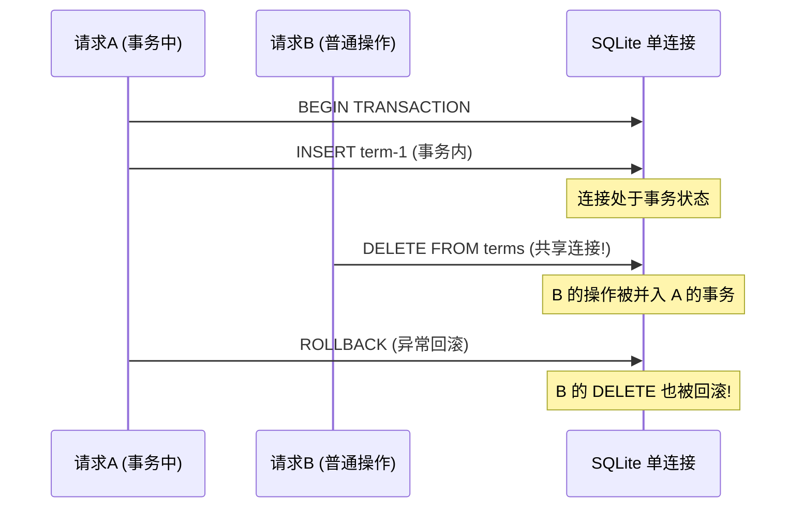
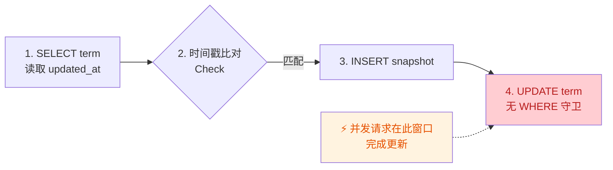

# GlossaHub 代码审查报告

> **审查日期**: 2025-07-09
> **审查范围**: `server.cjs` (后端) + `src/components/*` (前端) + `src/App.jsx` + `src/index.css`
> **问题总数**: 44 个 (5 Critical / 21 Major / 18 Minor)

---

## 问题总览

| 严重度 | 数量 | 说明 |
|--------|------|------|
| **Critical** | 5 | 安全漏洞或数据丢失风险 |
| **Major** | 21 | 并发竞态、内存泄漏、数据一致性 |
| **Minor** | 18 | 可访问性、健壮性、遗留代码 |

---

## 架构风险概览

### SQLite 事务隔离缺陷

### 词条更新乐观锁 TOCTOU 竞态

---

## Critical 问题 (5 个)

### C1: 预置管理员使用硬编码弱密码

- **文件**: [server.cjs:336-348](file:///Users/jacko/Desktop/Projects/glossa-hub/server.cjs#L336-L348)
- **问题**: 8 个管理员账户全部使用硬编码密码 `magene123`，代码在公开仓库中可被直接利用
- **修复**: 从环境变量 `INITIAL_ADMIN_PASSWORD` 读取，或首次启动随机生成

### C2: RBAC 完全未生效

- **文件**: [server.cjs](file:///Users/jacko/Desktop/Projects/glossa-hub/server.cjs) (全文)
- **问题**: `project_members` 表定义于行 244-253 但从未查询。所有端点仅验证 JWT，不验证项目归属
- **影响**: 任何登录用户可访问/修改/删除任意项目的全部数据
- **修复**: 添加 `requireProjectMember` 中间件

### C3: sync-cleanup 缺少管理员授权

- **文件**: [server.cjs:961-981](file:///Users/jacko/Desktop/Projects/glossa-hub/server.cjs#L961-L981)
- **问题**: 当 `activeTableIds` 为空时执行 `DELETE FROM terms` + `DELETE FROM versions`（无 WHERE），任何登录用户即可清空全部数据
- **修复**: 添加 `req.user.role === 'admin'` 校验

### C4: saveOfflineRecords 空数组守卫导致删除不生效

- **文件**: [TranslationTab.jsx:338-339](file:///Users/jacko/Desktop/Projects/glossa-hub/src/components/TranslationTab.jsx#L338-L339)
- **问题**: `if (recordsList.length === 0) return` 守卫导致删除全部词条时不同步到服务器，刷新后数据恢复
- **修复**: 移除 `length === 0` 检查，或将删除走独立 API

### C5: `/api/debug-status` 未鉴权泄露数据库信息

- **文件**: [server.cjs:2615-2623](file:///Users/jacko/Desktop/Projects/glossa-hub/server.cjs#L2615-L2623)
- **问题**: 泄露数据库类型、连接 host/port、用户名、错误详情
- **修复**: 添加 `authenticateToken` + admin 校验，或生产环境禁用

---

## Major 问题 (21 个)

### M1: SQLite 事务隔离失效——并发请求共享单连接

- **文件**: [server.cjs:550-562](file:///Users/jacko/Desktop/Projects/glossa-hub/server.cjs#L550-L562)
- **问题**: 事务中 `callback(this)` 传入共享连接，并发请求操作被并入同一事务
- **修复**: 为每个事务获取独立连接，或改用 `better-sqlite3` 同步事务

### M2: PUT /api/terms/:termId 乐观锁 TOCTOU 竞态

- **文件**: [server.cjs:1130-1210](file:///Users/jacko/Desktop/Projects/glossa-hub/server.cjs#L1130-L1210)
- **问题**: SELECT（Check）与 UPDATE（Use）之间无原子保证，并发请求可绕过时间戳校验
- **修复**: `UPDATE terms SET ... WHERE id=$1 AND updated_at=$2`，检查 `rowCount`

### M3: INSERT OR REPLACE 重置锁定与工作流状态

- **文件**: [server.cjs:857-861](file:///Users/jacko/Desktop/Projects/glossa-hub/server.cjs#L857-L861)
- **问题**: SQLite 的 `INSERT OR REPLACE` 先删除再插入，`is_locked`/`status`/`reject_reason` 全部重置为默认值
- **修复**: 改用 `INSERT ... ON CONFLICT(version_id, kw) DO UPDATE SET`

### M4: 快照保存与主表更新不在同一事务中

- **文件**: [server.cjs:1176-1210](file:///Users/jacko/Desktop/Projects/glossa-hub/server.cjs#L1176-L1210)
- **问题**: 快照 INSERT 与词条 UPDATE 是两次独立操作，UPDATE 失败产生孤立快照
- **修复**: 包裹在 `db.transaction()` 中

### M5: loadTableData 竞态条件

- **文件**: [TranslationTab.jsx:417-458](file:///Users/jacko/Desktop/Projects/glossa-hub/src/components/TranslationTab.jsx#L417-L458)
- **问题**: 快速切换版本表时，两个请求并发执行，旧响应可能覆盖新数据
- **修复**: 使用 AbortController 或 stale flag

### M6: filteredRecords 缺少 TARGET_LANGUAGES 依赖

- **文件**: [TranslationTab.jsx:515-579](file:///Users/jacko/Desktop/Projects/glossa-hub/src/components/TranslationTab.jsx#L515-L579)
- **问题**: `useMemo` 依赖数组缺少 `TARGET_LANGUAGES`，语种列表异步加载后不重新计算
- **修复**: 添加到依赖数组

### M7: 日志操作人硬编码回退为 "王赵云"

- **文件**: [LogsTab.jsx:100,315,374,399](file:///Users/jacko/Desktop/Projects/glossa-hub/src/components/LogsTab.jsx#L100)
- **问题**: 缺失操作人时回退为真实人名，导致错误归属
- **修复**: 改为 `'未知用户'`

### M8: LogsTab 错误状态被静默吞没

- **文件**: [LogsTab.jsx:12,32-33](file:///Users/jacko/Desktop/Projects/glossa-hub/src/components/LogsTab.jsx#L12)
- **问题**: `_error` 变量带下划线前缀从未渲染，API 失败时用户看到空状态
- **修复**: 移除下划线前缀并渲染错误状态 + 重试按钮

### M9: CSV 导出 Object URL 未释放（内存泄漏）

- **文件**: [TranslationTab.jsx:1744-1756](file:///Users/jacko/Desktop/Projects/glossa-hub/src/components/TranslationTab.jsx#L1744-L1756), [GlossaryTab.jsx:210-217](file:///Users/jacko/Desktop/Projects/glossa-hub/src/components/GlossaryTab.jsx#L210-L217)
- **修复**: `link.click()` 后调用 `URL.revokeObjectURL(url)`

### M10: showStatus 的 setTimeout 未在卸载时清理

- **文件**: [TranslationTab.jsx:467-472](file:///Users/jacko/Desktop/Projects/glossa-hub/src/components/TranslationTab.jsx#L467-L472)
- **修复**: 使用 `useRef` 跟踪 timer，卸载时 `clearTimeout`

### M11: 批量翻译直接突变状态对象

- **文件**: [TranslationTab.jsx:1145,1339](file:///Users/jacko/Desktop/Projects/glossa-hub/src/components/TranslationTab.jsx#L1145)
- **问题**: `item.translations = trans` 直接修改 React state 中的原始对象
- **修复**: 使用 `{ ...item, translations: trans }` 创建新对象

### M12: CSV 导入闭包陈旧

- **文件**: [TranslationTab.jsx:1635-1708](file:///Users/jacko/Desktop/Projects/glossa-hub/src/components/TranslationTab.jsx#L1635-L1708)
- **问题**: `reader.onload` 捕获渲染时的 `records` 快照，异步读取期间的修改会被覆盖
- **修复**: 使用函数式更新 `setRecords(prev => ...)`

### M13: 引用未定义 CSS 变量 `--bg-darker`

- **文件**: [App.jsx:495](file:///Users/jacko/Desktop/Projects/glossa-hub/src/App.jsx#L495)
- **修复**: 改为 `var(--bg-primary)`

### M14: 引用未定义 CSS 变量 `--transition`

- **文件**: [App.jsx:450](file:///Users/jacko/Desktop/Projects/glossa-hub/src/App.jsx#L450)
- **修复**: 改为 `transition: 'color 0.2s, background-color 0.2s'`

### M15: 登录标题渐变硬编码 `#ffffff`，明亮模式不可见

- **文件**: [App.jsx:204](file:///Users/jacko/Desktop/Projects/glossa-hub/src/App.jsx#L204)
- **问题**: 白底白字渐变，明亮模式标题几乎不可见
- **修复**: 改为 `var(--logo-gradient)`

### M16: toolbar-action-btn 硬编码暗色 RGB 值

- **文件**: [index.css:348,352,357,361,375,379](file:///Users/jacko/Desktop/Projects/glossa-hub/src/index.css#L348)
- **问题**: `rgba(16, 185, 129, 0.4)` 对应暗色模式绿色，明亮模式下 `--green` 是 `#059669`
- **修复**: 改用 `rgba(var(--green-rgb), 0.4)` 并补充 RGB 变量

### M17: 新建版本 inheritedCount 始终返回 1

- **文件**: [server.cjs:1113](file:///Users/jacko/Desktop/Projects/glossa-hub/server.cjs#L1113)
- **问题**: `baseVersionId ? 1 : 0` 应为 `baseVersionId ? baseTerms.length : 0`
- **修复**: 返回实际复制条数

### M18: Dify apiKey 响应谎称"已加密存入数据库"

- **文件**: [server.cjs:1874-1880](file:///Users/jacko/Desktop/Projects/glossa-hub/server.cjs#L1874-L1880)
- **修复**: 实现加密或修改消息为"已安全存入数据库"

### M19: GET /api/tables 存在 N+1 查询

- **文件**: [server.cjs:644-669](file:///Users/jacko/Desktop/Projects/glossa-hub/server.cjs#L644-L669)
- **问题**: 每个版本单独查询最新日志
- **修复**: 改为 `LEFT JOIN LATERAL` 或子查询

### M20: 语种重命名/删除的 JSON 迁移未在事务中执行

- **文件**: [server.cjs:2116-2151](file:///Users/jacko/Desktop/Projects/glossa-hub/server.cjs#L2116-L2151), [server.cjs:2170-2199](file:///Users/jacko/Desktop/Projects/glossa-hub/server.cjs#L2170-L2199)
- **修复**: 包裹在 `db.transaction()` 中

### M21: 主题初始化 FOUC（首屏闪烁）

- **文件**: [App.jsx:40,43-50](file:///Users/jacko/Desktop/Projects/glossa-hub/src/App.jsx#L40)
- **问题**: 主题在 React 挂载后才应用，明亮模式用户首屏看到暗色闪烁
- **修复**: 在 `index.html` 添加阻塞式 `<script>` 提前设置主题类

---

## Minor 问题 (18 个)

| # | 问题 | 文件 | 修复建议 |
|---|------|------|---------|
| m1 | batch-copy 未校验策略取值 | server.cjs:1505 | 添加白名单校验 |
| m2 | AI 用量日志错误被静默吞掉 | server.cjs:1958 | `.catch(err => console.error(...))` |
| m3 | batch-approve N×4 查询爆炸 | server.cjs:1786-1829 | 批量查询+批量更新 |
| m4 | handleEditModalAiTranslate res.json() 二次异常 | TranslationTab.jsx:1492 | `.catch(() => ({}))` |
| m5 | currentUser 空依赖不更新 | TranslationTab.jsx:155-162 | 监听 storage 事件 |
| m6 | GlossaModal 缺少 Focus Trap | GlossaModal.jsx:76-80 | 实现 Tab 键循环 |
| m7 | 筛选开关缺少键盘支持 | TranslationTab.jsx:1804 | 添加 role/tabIndex/onKeyDown |
| m8 | Dashboard 轮询不检查页面可见性 | DashboardTab.jsx:73-78 | visibilitychange 暂停/恢复 |
| m9 | ErrorBoundary 不捕获异步错误 | ErrorBoundary.jsx | 订阅 window error/unhandledrejection |
| m10 | 主题切换按钮缺少 aria-label | App.jsx:439 | 添加 aria-label |
| m11 | `<html lang="en">` 应为 `zh-CN` | index.html:2 | 改 lang 属性 |
| m12 | Dify 状态指示无 aria-live | App.jsx:459 | 添加 role="status" |
| m13 | getBreadcrumbTitle 缺少 guide 分支 | App.jsx:181 | 补充 case |
| m14 | selectedTableId 切换 tab 不清空 | App.jsx:52 | 无条件赋值 |
| m15 | 侧栏折叠状态未持久化 | App.jsx:37 | localStorage |
| m16 | 页脚版本号与 package.json 不一致 | App.jsx:506 | 注入构建版本 |
| m17 | 登录失败信息泄露后端地址 | App.jsx:166 | 移除 API_BASE 显示 |
| m18 | nav 缺少 aria-label | App.jsx:282 | 添加 aria-label |

---

## 修复优先级

| 优先级 | 问题编号 | 理由 |
|--------|---------|------|
| **P0 立即修复** | C1, C2, C3, C4, C5 | 安全漏洞 + 数据丢失 |
| **P1 本周修复** | M2, M3, M4, M5, M11, M12 | 并发安全 + 数据一致性 |
| **P2 下个迭代** | M1, M6-M10, M13-M21 | 架构/性能/体验 |
| **P3 择机修复** | m1-m18 | 健壮性/可访问性 |

关键修复摘要
P0-1（最严重）：批量新增词条现在会先拉取目标版本的全量记录，合并后再同步，彻底避免了与之前相同类型的"数据全丢" bug
P0-2：服务端 sync-table 增加了安全守卫，当版本已有数据时拒绝空数组清除
P1-3：锁定的词条现在在 sync-table 的 DELETE 和 upsert 中都会被保护，不会被意外覆盖或删除
P1-4：saveOfflineRecords 现在会检查 HTTP 响应状态，后端失败时前端会立即报错，不再静默吞掉错误
P2-3：删除操作改为"先保存数据库，成功后再更新 UI"，避免网络失败导致数据"复活"