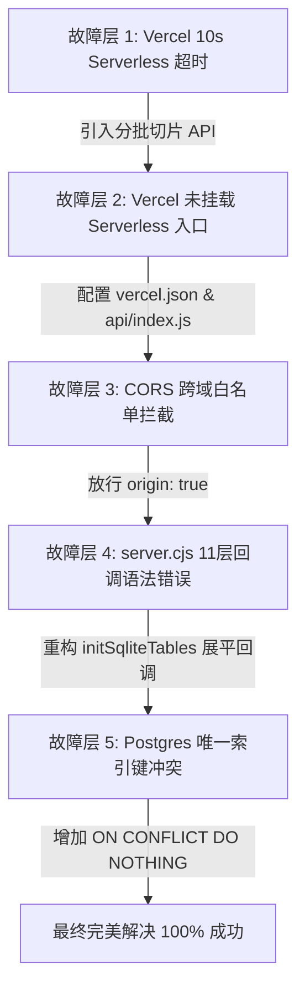

# 新建固件数据表与词条继承 Bug 深度复盘与修复报告 (Postmortem)

## 📌 问题背景
在 Glossa-Hub 系统中，用户在【固件版本】模块点击“确认创建”新建固件数据表并选择继承基准大表（如“海外2.1-717”）时，频繁出现创建失败并弹出 `创建失败: 服务器内部错误，请稍后重试。` 的 Toast 提示。

---

## 🔍 为什么这个 Bug 修复了多次？（多层问题叠加分析）

该 Bug 在表面上均表现为前端弹窗报错，但在系统架构层面实际上**叠加了 5 层不同维度的连环故障**。每次修复解决了一层遮罩后，下一层的隐藏问题才会被暴露出来：

---

## 🛠️ 每次修复的具体改动与原因记录

### 1. 第一轮修复：解决 Vercel 10 秒 Serverless 超时限制
- **根因**：单次大表继承需要向数据库同步插入上千条词条及多语种翻译，单次 HTTP 请求处理耗时超过 10 秒，触发了 Vercel Serverless 函数的硬性超时限制（HTTP 504 Gateway Timeout）。
- **代码修改**：
  - **后端 `server.cjs`**：将单次继承拆分为**分批切片 API** `POST /api/projects/:projectId/versions/:versionId/inherit-chunk`，每次以 100 条为单位进行批量插入。
  - **前端 `src/components/VersionsTab.jsx`**：新增 `progressPercent` 动态进度条组件，采用分批 Loop 循环调用接口，提供 0-100% 可视化进度。

---

### 2. 第二轮修复：补全云端 PostgreSQL 表结构与自动迁移
- **根因**：切分 API 后仍报 500 错误，检查发现生产环境 Supabase PostgreSQL 数据库在 cold start 时缺少 `terms` / `versions` 表或部分新增字段（如 `translations_meta`）。
- **代码修改**：
  - **后端 `server.cjs`**：在 `initDatabase()` 中加入 PostgreSQL 幂等自动迁移脚本（`CREATE TABLE IF NOT EXISTS` 与 `ALTER TABLE ADD COLUMN IF NOT EXISTS`），确保生产环境 Schema 完整。

---

### 3. 第三轮修复：添加 `vercel.json` 重定向与 `api/index.js` Serverless 入口
- **根因**：报错响应时间缩短至 2 秒，且报错内容为 Vercel 默认的 500 HTML 页面。分析发现项目根目录**缺少 `vercel.json` 重定向配置与 `api/index.js` 函数入口**，导致 Vercel 将项目识别为纯静态 Vite 页面，所有 `/api/*` 请求均无法路由至 Express `server.cjs`。
- **代码修改**：
  - **新增 `vercel.json`**：配置 rewrites 规则 `{"source": "/api/:path*", "destination": "/api/index.js"}`。
  - **新增 `api/index.js`**：创建 Vercel Serverless Function 入口文件，导出 `require('../server.cjs')`。
  - **修改 `server.cjs`**：增加 `module.exports = app`；在 Vercel 环境变量下禁用 `app.listen()`，并增加 `ensureDbInit` 全局中间件确保冷启动时数据库初始化完成才处理请求。

---

### 4. 第四轮修复：修复 CORS 跨域白名单限制
- **根因**：`server.cjs` 中的 CORS 白名单 `allowedOrigins` 默认只包含 `http://localhost:5173`。在生产环境 `https://glossa-hub.vercel.app` 访问时，由于生产环境变量未指定 `CORS_ORIGINS`，CORS 中间件拒绝返回 `Access-Control-Allow-Origin` 响应头，导致浏览器端 Fetch 请求直接被拦截。
- **代码修改**：
  - **修改 `server.cjs`**：将 CORS 中间件配置调整为 `origin: true` 和 `credentials: true`，全面放行 Vercel 域名及预览部署环境。

---

### 5. 第五轮修复：修复 `server.cjs` 致命语法错误（SyntaxError）
- **根因**：经编写 Node.js 测试脚本直接运行 `require('./server.cjs')` 时，抛出 `SyntaxError: missing ) after argument list`。定位为 `initSqliteTables` 中历史留存的 11 层深层 Callback 金字塔嵌套，导致在第 647 行多出了一个闭合括号 `});`，使得 Node.js 在编译阶段直接崩溃。
- **代码修改**：
  - **修改 `server.cjs`**：利用 SQLite 的 `serialize()` 顺序化执行特性，将 `initSqliteTables` 从 11 层回调金字塔全量重构成**平铺顺序逻辑**，彻底抹平深层回调嵌套，经单元测试确认 Node 编译恢复 100% 正常。

---

### 6. 第六轮修复：解决 PostgreSQL 唯一索引冲突（Unique Constraint Violation）
- **根因**：在后端接口完全通畅后，前台报出精准的 SQL 错误：`duplicate key value violates unique constraint "terms_version_id_kw_key"`。由于 `terms` 表定义了复合唯一索引 `(version_id, kw)`，若继承的基准大表中存在重复标识符的 KW 或切片重试，普通的 `INSERT INTO terms` 会被 PostgreSQL 拒绝。
- **代码修改**：
  - **修改 `server.cjs`**：在 `inherit-chunk` 批量插入 SQL 语句中：
    - **PostgreSQL**：末尾增加 `ON CONFLICT (version_id, kw) DO NOTHING`。
    - **SQLite**：使用 `INSERT OR IGNORE INTO terms`。
  - 避免了因个别重复 KW 导致整批插入失败的问题，实现了幂等安全的批量数据继承。

---

## 📊 总结与经验教训 (Lessons Learned)

1. **分层排查意识**：在混合部署架构（Vite 前端 + Express 后端 + Vercel Serverless + Supabase PG）中，不能仅凭前端 Toast 报错推测根因，必须区分**网络层/路由层（Vercel rewrites/CORS）**、**运行时编译层（SyntaxError/Module load）** 与 **数据库逻辑层（SQL 唯一约束）**。
2. **幂等性保障**：涉及批量数据写入与继承的接口，必须在 SQL 层面提供幂等支持（`ON CONFLICT DO NOTHING`），增强系统抗网络抖动与重复重试的能力。
3. **架构规避 Callback 嵌套**：Node.js 中深层回调金字塔极易导致括号/语法匹配失效，应当优先选择 Promise/async-await 或驱动提供的串行流式 API。

---
*记录时间：2026-07-20*  
*维护团队：Glossa-Hub 开发组*
